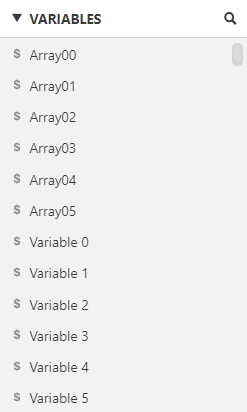

# GB Studio Basic Array Plugin
This plugin allows you to treat an ordered list of global variables as a basic array. There is some required set up by the user to ensure the array functionality works.

## Step 1
Order your global variables. By default GB Studio's global variables names are `Variable #`. You can choose to go with the default names or go with custom names. This plugin requires that you set a number of variables in ascending order based off the GB Studio's global variable list.

