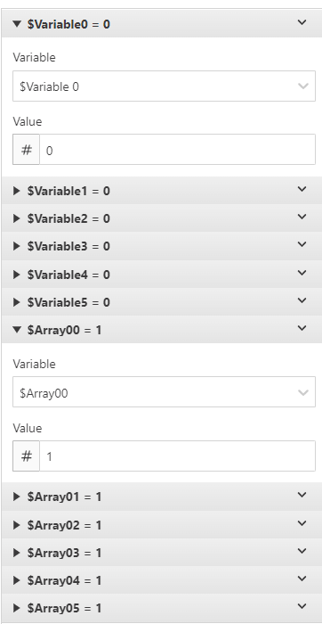

# GB Studio Basic Array Plugin
This plugin allows you to treat an ordered list of global variables as a basic array. There is some required set up by the user to ensure the array functionality works.

## Step 1
Order your global variables. By default GB Studio's global variables names are `Variable #`. You can choose to go with the default names or go with custom names. This plugin requires that you set a number of variables in ascending order based off the GB Studio's global variable list. Failure to do this will cause issues when you try to access or write to your array.

The example shown here has `Variable 50` to `Variable 55` renamed to `Array00` to `Array05` But we can also use `Variable 0` to `Variable 5` for our array as well.

## Step 2
Initialize your intended array with GB Studio's `Variable Set to Value` event. GB Studio will not acknowledge the Global Variables until they are touched by an event first. Failure to do this will cause issues when accessing and writing to your array.

This example is to show how to ensure the values are touched. Doing this first will ensure the plugin will work.

## Step 3
Use the plugin. The current plugin has 3 events. The ability to set a value at an index, return and store a value into a variable from an index, and find the first index of a given value.
